# Condition Examples 

 

## Additional unidentified audio tape stock spliced into the tape pack  
*Example* 
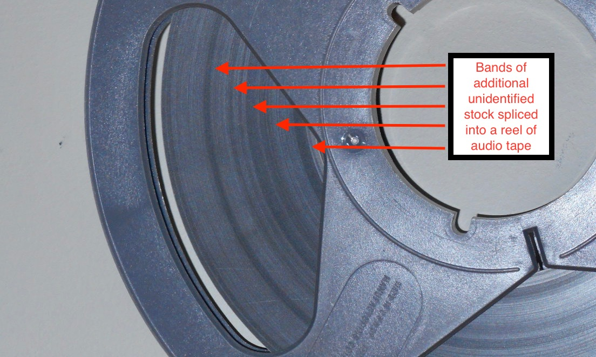.
  
## Azimuth varies throughout.  
  
  Open-reel tapes marked "copy 1" in  Himan Brown collection are produced with multiple physical edits within a single program. The azimuth between the sections of edited tape often varries significantly.
  
*Example, correlation offsets between edits*

      
 ## Damaged container.   
*Example* 
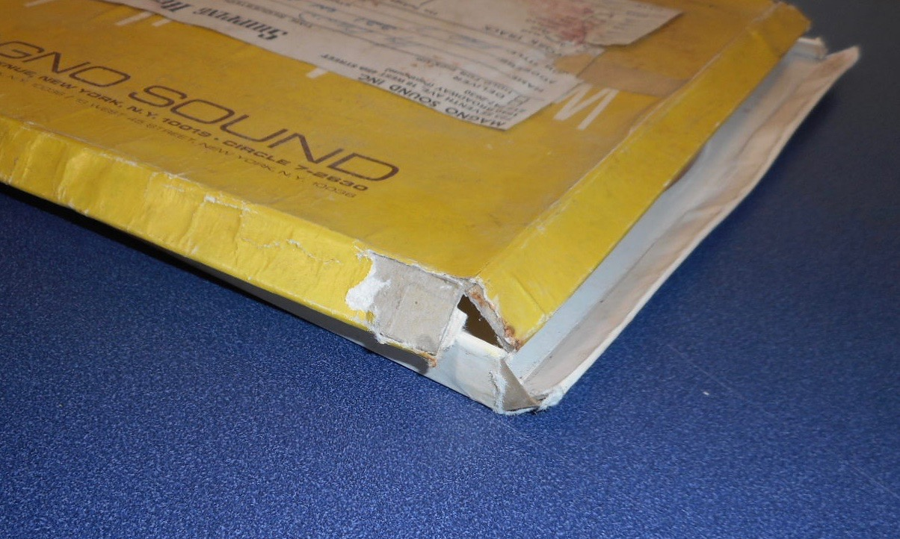
    
## Damaged leader tape.  
*Example* 

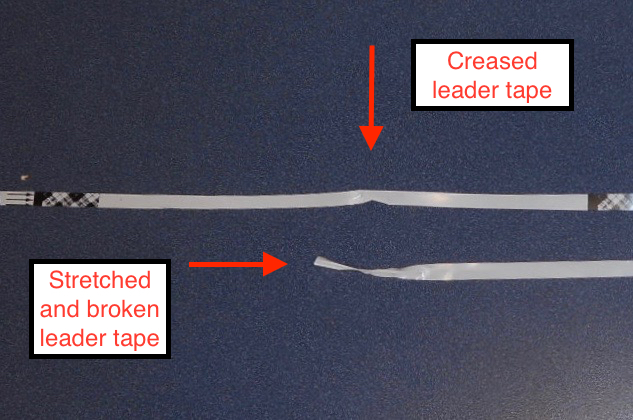

## Dimmensional distortion in the tape base
   
*Example 1, creased and folded mylar base*.  

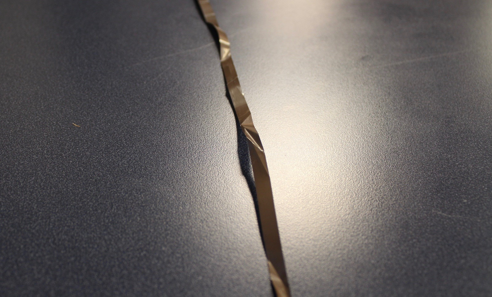
. 

*Example 2, shrunken acetate base*.

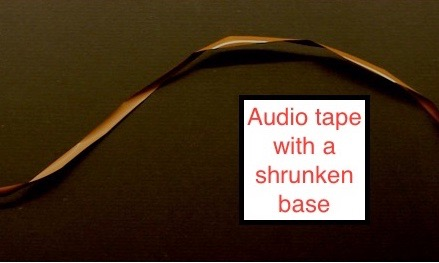
   

*Example 3, stretched mylar-based tape*.

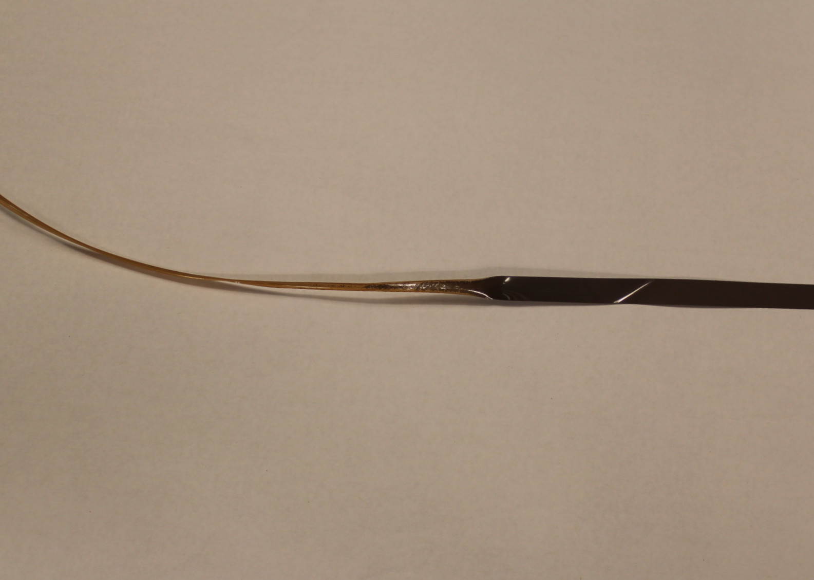
   

## Dust or other particulate matter.   
*Example* 
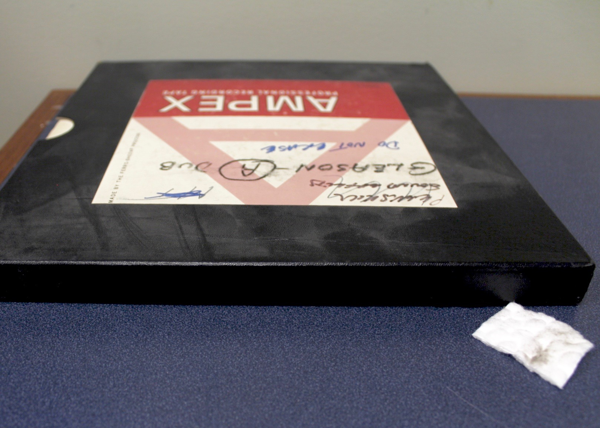. 

## Failed splicing tape adhesive  

*Example 1, desicated splicing tape adhesive* 
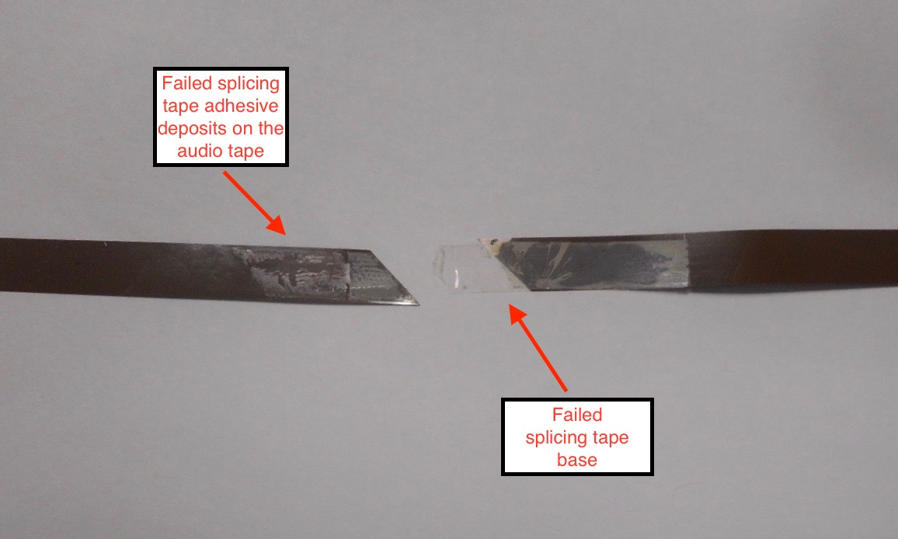. 

*Example 2, soft splice adhesive which has migrated to the pack surface*  

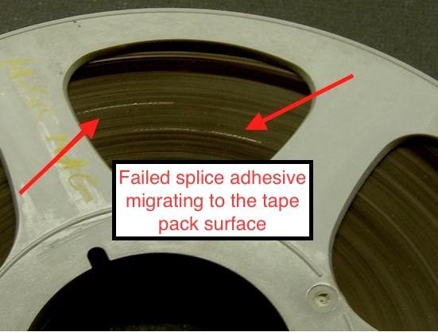
. 
  
*Example 3, separated splice joint and mis-aligned splicing tape**  

  

*Example 4, mis-aligned splicing tape prodtruding from the tape pack*  

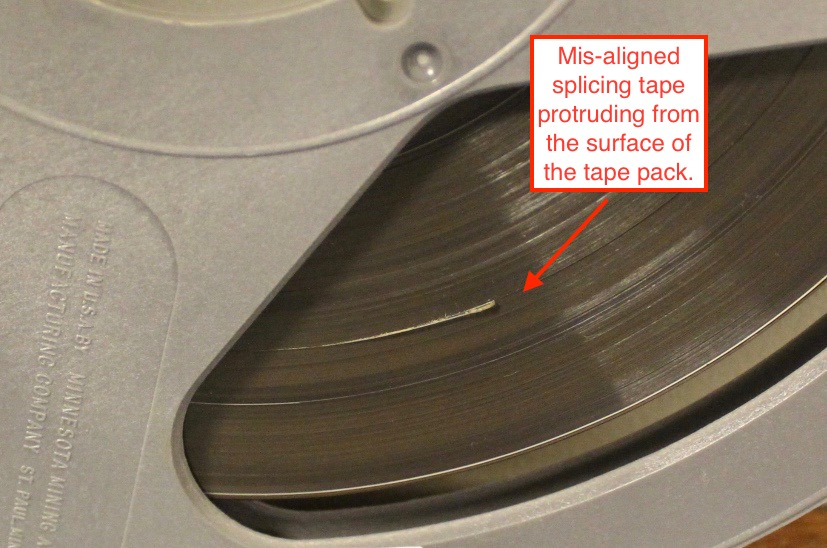
 

*Example 5, compound splice with failed splicing tape removed*  

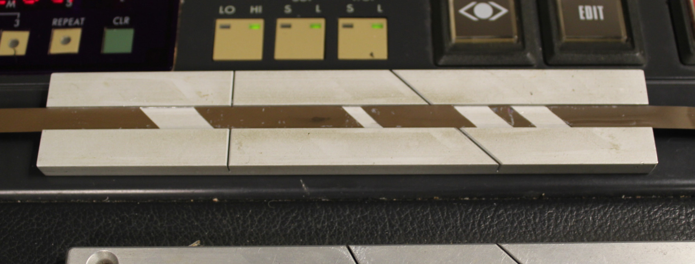

*Example 6, soft splicing tape adhesive which has migrated to the emulsion layer of the audio tape adhering the deck heads **  

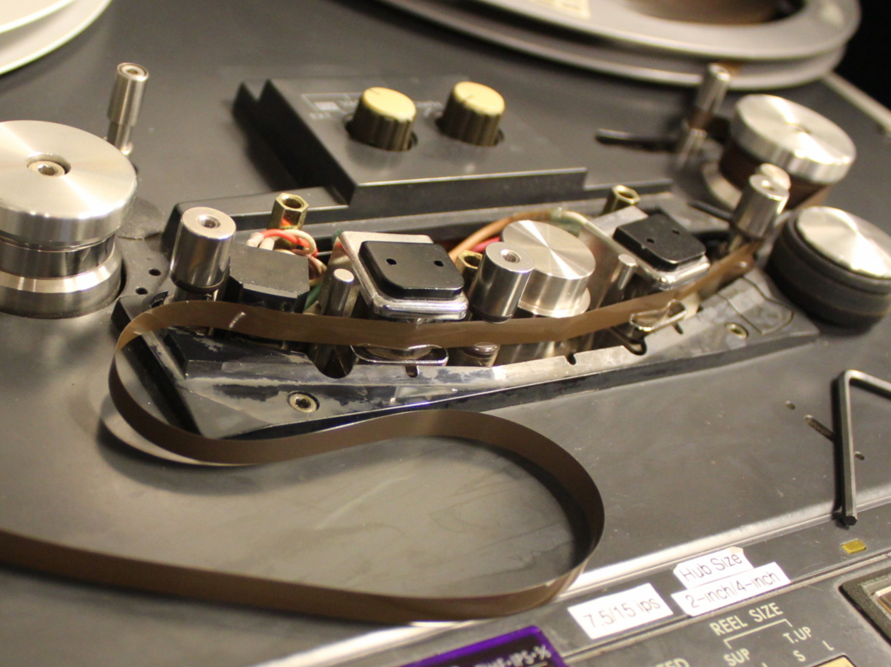

## Loss in the emulsion layer of audio tape.  
*Example* 

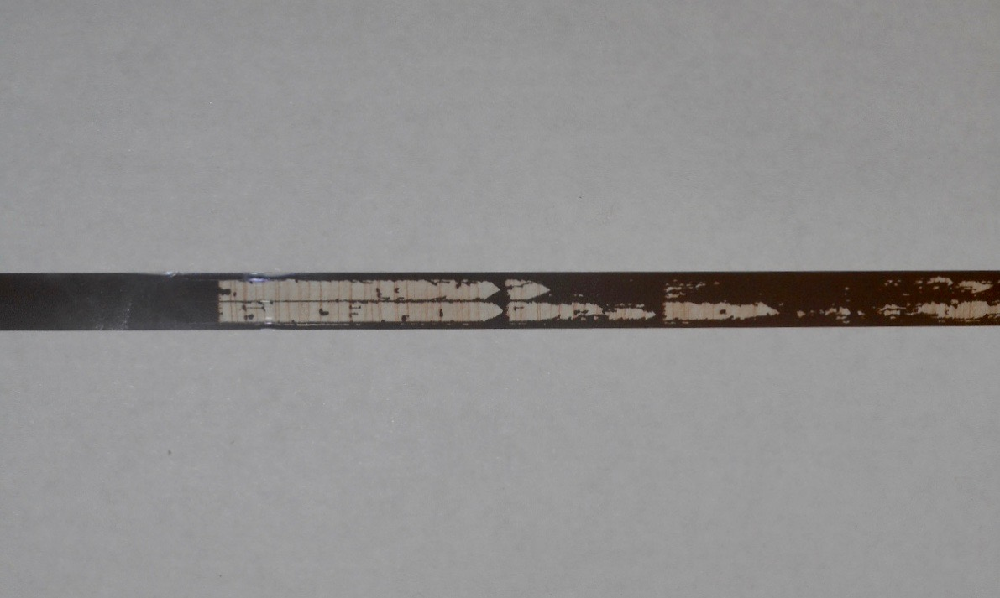
. 

## Mold contamination.  

*Example 1* 
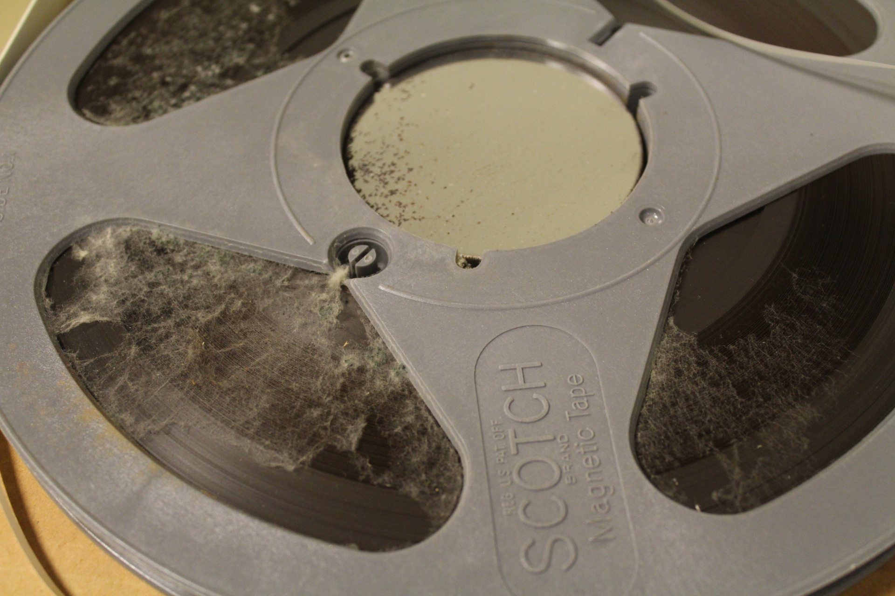.

*Example 2* 
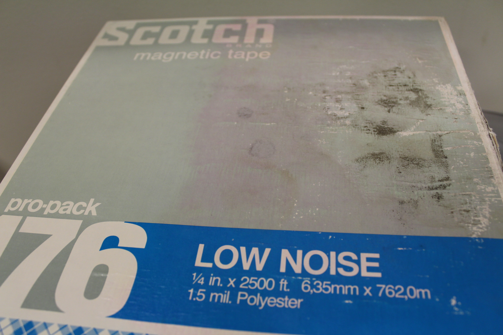.

*Example 3* 
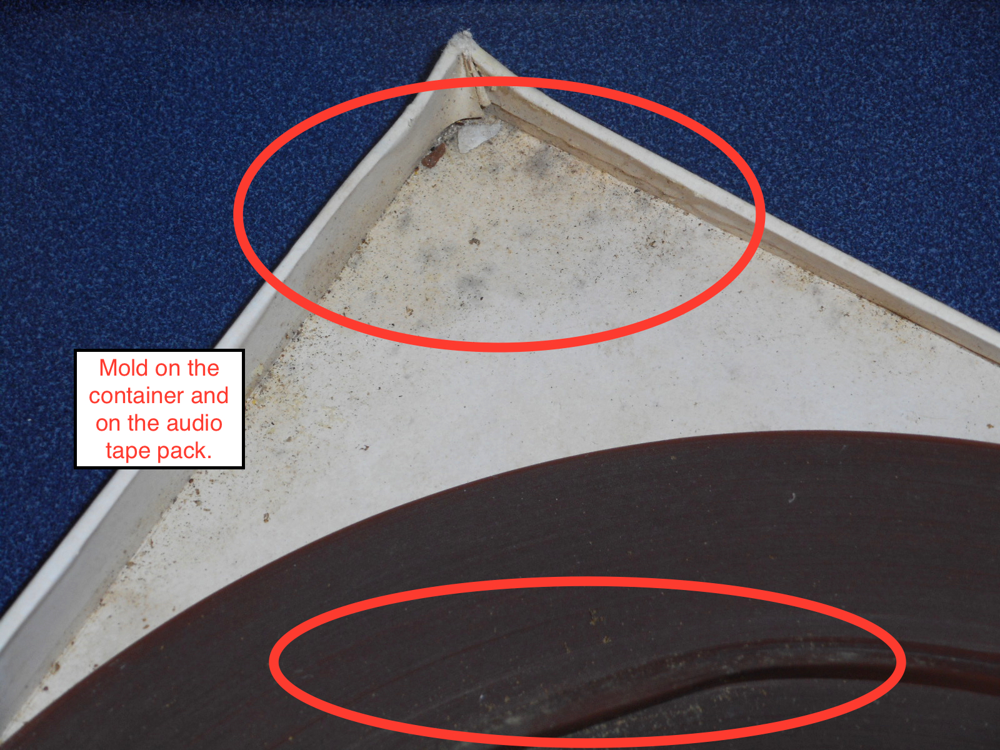.   
  

## Not stored in an "archival wind"  

*Example* 
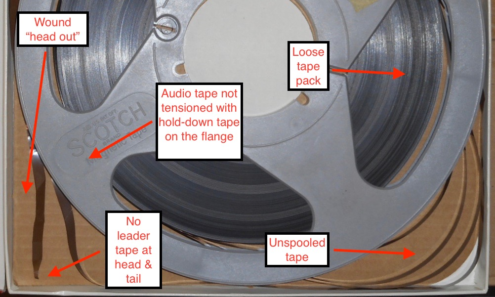.

*Example, tape stored as a "pancake" --hub only, no flanges; also evident is an example of popped strands* 
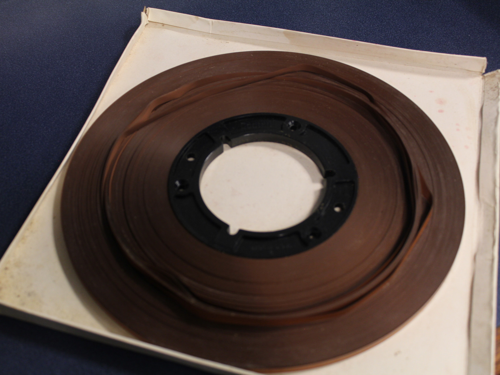.

